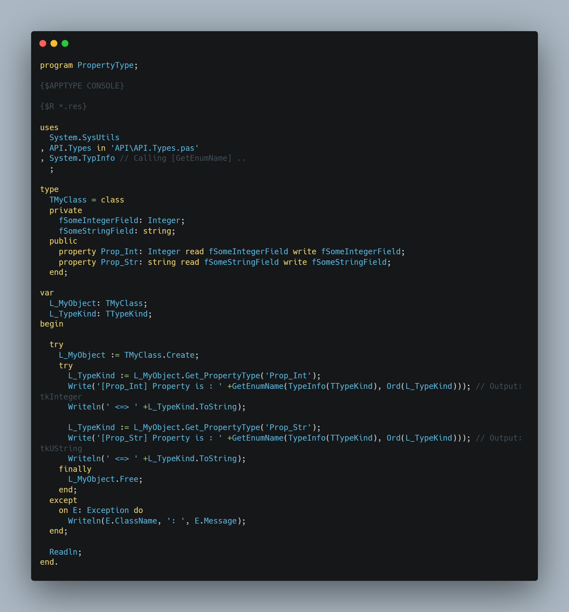
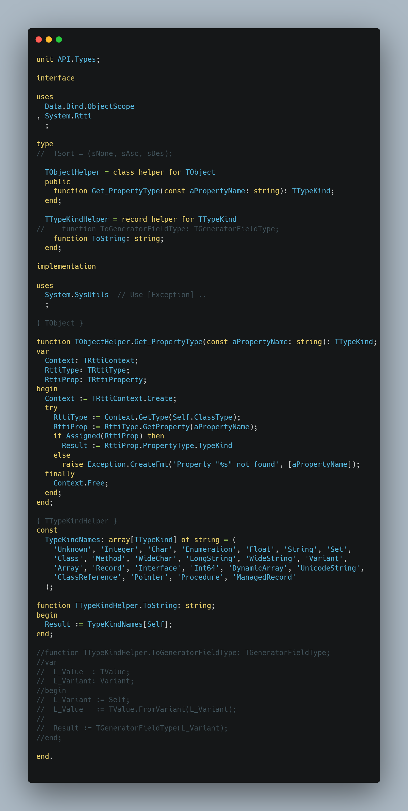
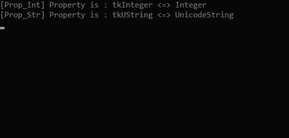

# PropertyType

 TObject Class Helper to Get Property Type (useful in OOP to parse datatype correctly)

 # Link Facebook Discussion here:
https://www.facebook.com/groups/DelphiDevelopers/permalink/2814834405331463/

 

 

 
